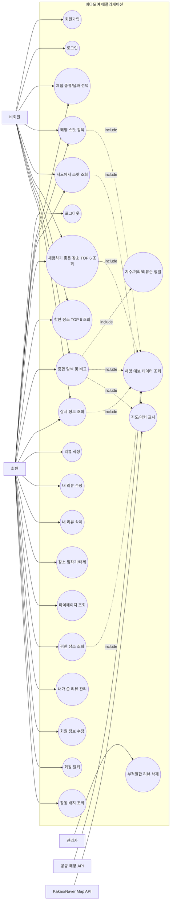

# Use Case Diagram

```mermaid
flowchart LR
    guest["비회원"]
    user["회원"]
    admin["관리자"]
    publicApi["공공 해양 API"]
    mapApi["Kakao/Naver Map API"]

    subgraph system["바다모여 애플리케이션"]
        signup(("회원가입"))
        login(("로그인"))
        logout(("로그아웃"))

        selectCondition(("체험 종류/날짜 선택"))
        searchSpot(("해양 스팟 검색"))
        viewMap(("지도에서 스팟 조회"))
        viewTopGood(("체험하기 좋은 장소 TOP 6 조회"))
        viewTopHot(("핫한 장소 TOP 6 조회"))
        compareSpot(("종합 탐색 및 비교"))
        sortSpot(("지수/거리/리뷰순 정렬"))
        viewDetail(("상세 정보 조회"))

        writeReview(("리뷰 작성"))
        editReview(("내 리뷰 수정"))
        deleteReview(("내 리뷰 삭제"))
        bookmarkSpot(("장소 찜하기/해제"))

        viewMyPage(("마이페이지 조회"))
        viewBookmarks(("찜한 장소 조회"))
        viewMyReviews(("내가 쓴 리뷰 관리"))
        updateProfile(("회원 정보 수정"))
        withdraw(("회원 탈퇴"))
        viewBadge(("활동 배지 조회"))

        moderateReview(("부적절한 리뷰 삭제"))
        fetchForecast(("해양 예보 데이터 조회"))
        renderMap(("지도/마커 표시"))
    end

    guest --> signup
    guest --> login
    guest --> selectCondition
    guest --> searchSpot
    guest --> viewMap
    guest --> viewTopGood
    guest --> viewTopHot
    guest --> compareSpot
    guest --> viewDetail

    user --> logout
    user --> selectCondition
    user --> searchSpot
    user --> viewMap
    user --> viewTopGood
    user --> viewTopHot
    user --> compareSpot
    user --> viewDetail
    user --> writeReview
    user --> editReview
    user --> deleteReview
    user --> bookmarkSpot
    user --> viewMyPage
    user --> viewBookmarks
    user --> viewMyReviews
    user --> updateProfile
    user --> withdraw
    user --> viewBadge

    admin --> moderateReview

    searchSpot -. include .-> fetchForecast
    viewTopGood -. include .-> fetchForecast
    compareSpot -. include .-> sortSpot
    compareSpot -. include .-> fetchForecast
    viewDetail -. include .-> fetchForecast
    viewMap -. include .-> renderMap
    compareSpot -. include .-> renderMap
    viewBookmarks -. include .-> fetchForecast

    publicApi --> fetchForecast
    mapApi --> renderMap
```

