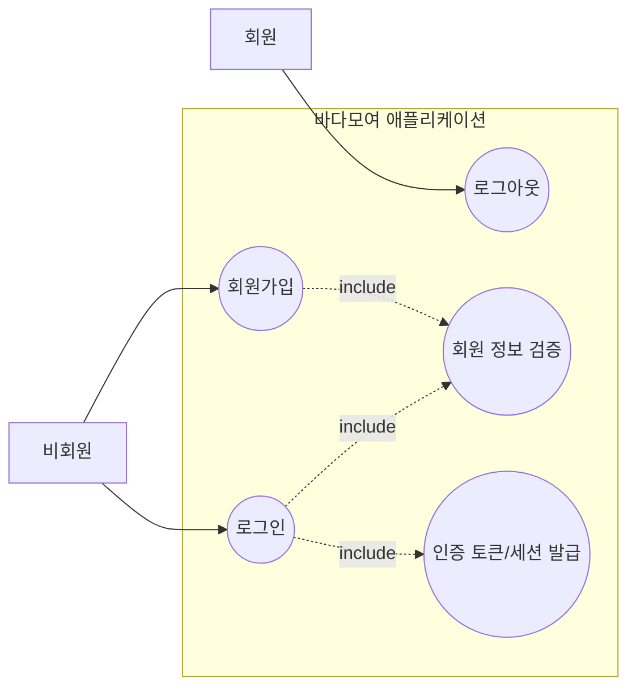
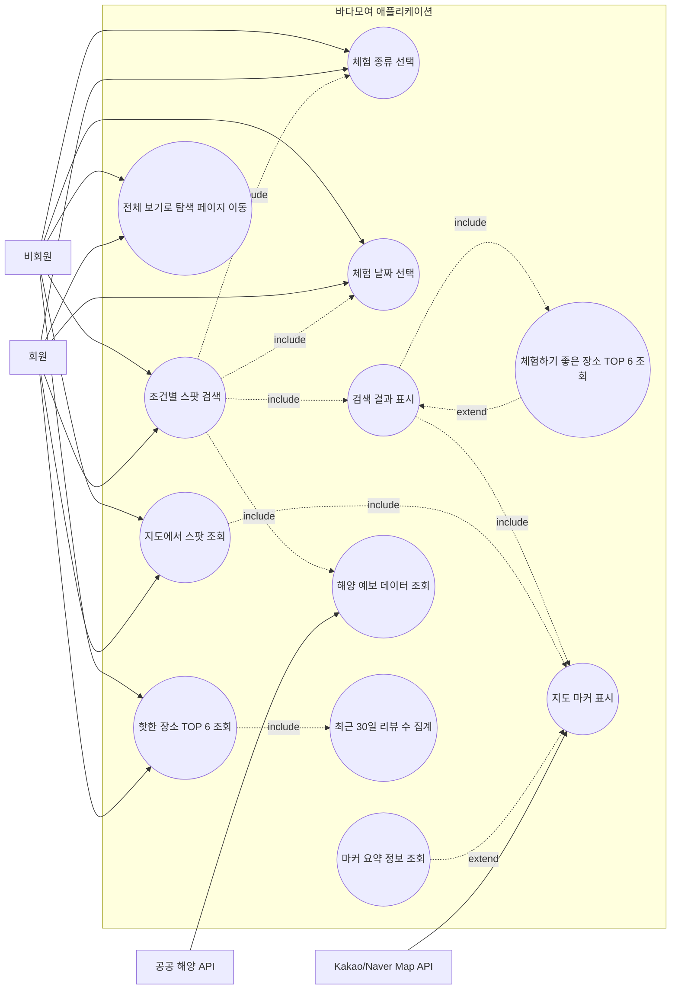
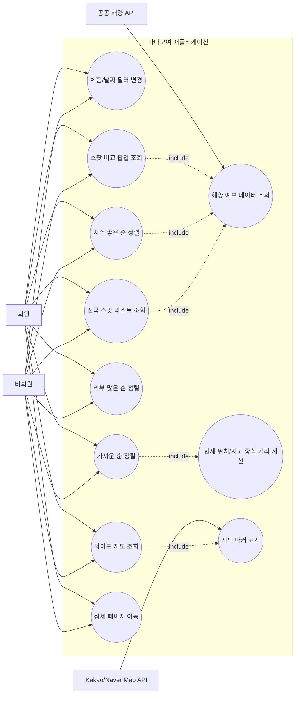
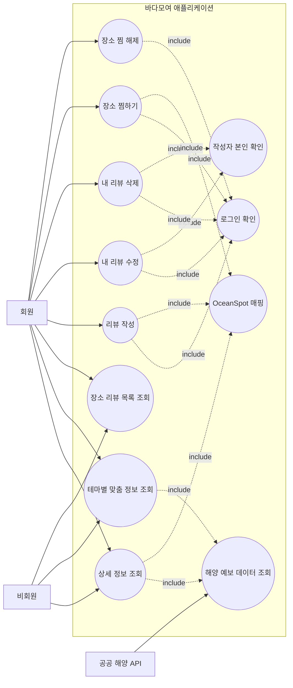
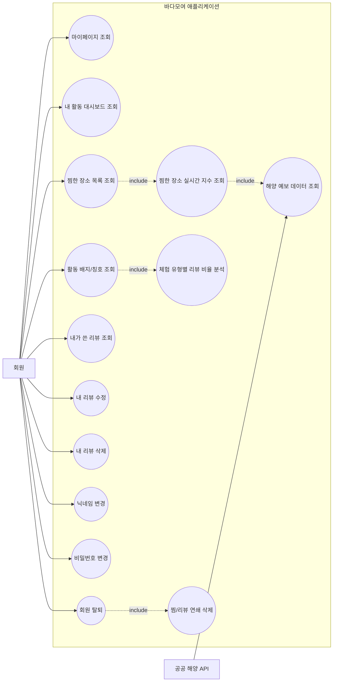
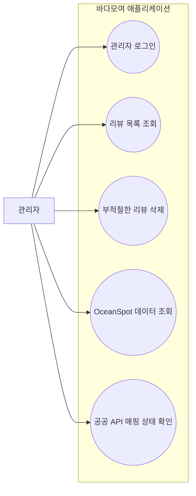

# Use Case Diagrams

## 1. 회원 및 인증 Usecase

```mermaid
flowchart LR
    guest["비회원"]
    user["회원"]

    subgraph system["바다모여 애플리케이션"]
        signup(("회원가입"))
        login(("로그인"))
        logout(("로그아웃"))
        validateUser(("회원 정보 검증"))
        issueToken(("인증 토큰/세션 발급"))
    end

    guest --> signup
    guest --> login
    user --> logout

    signup -. include .-> validateUser
    login -. include .-> validateUser
    login -. include .-> issueToken
```

## 2. 메인 화면 Usecase

```mermaid
flowchart LR
    guest["비회원"]
    user["회원"]
    publicApi["공공 해양 API"]
    mapApi["Kakao/Naver Map API"]

    subgraph system["바다모여 애플리케이션"]
        selectTheme(("체험 종류 선택"))
        selectDate(("체험 날짜 선택"))
        searchSpot(("조건별 스팟 검색"))
        showSearchResult(("검색 결과 표시"))
        viewMap(("지도에서 스팟 조회"))
        viewMarker(("마커 요약 정보 조회"))
        viewGoodTop(("체험하기 좋은 장소 TOP 6 조회"))
        viewHotTop(("핫한 장소 TOP 6 조회"))
        goExplore(("전체 보기로 탐색 페이지 이동"))
        fetchForecast(("해양 예보 데이터 조회"))
        renderMarker(("지도 마커 표시"))
        countReview(("최근 30일 리뷰 수 집계"))
    end

    guest --> selectTheme
    guest --> selectDate
    guest --> searchSpot
    guest --> viewMap
    guest --> viewHotTop
    guest --> goExplore

    user --> selectTheme
    user --> selectDate
    user --> searchSpot
    user --> viewMap
    user --> viewHotTop
    user --> goExplore

    searchSpot -. include .-> selectTheme
    searchSpot -. include .-> selectDate
    searchSpot -. include .-> fetchForecast
    searchSpot -. include .-> showSearchResult
    showSearchResult -. include .-> viewGoodTop
    showSearchResult -. include .-> renderMarker
    viewMap -. include .-> renderMarker
    viewMarker -. extend .-> renderMarker
    viewGoodTop -. extend .-> showSearchResult
    viewHotTop -. include .-> countReview

    publicApi --> fetchForecast
    mapApi --> renderMarker
```

## 3. 종합 탐색 및 지도 비교 Usecase

```mermaid
flowchart LR
    guest["비회원"]
    user["회원"]
    publicApi["공공 해양 API"]
    mapApi["Kakao/Naver Map API"]

    subgraph system["바다모여 애플리케이션"]
        setFilter(("체험/날짜 필터 변경"))
        viewSpotList(("전국 스팟 리스트 조회"))
        sortByIndex(("지수 좋은 순 정렬"))
        sortByDistance(("가까운 순 정렬"))
        sortByReview(("리뷰 많은 순 정렬"))
        viewWideMap(("와이드 지도 조회"))
        viewOverlay(("스팟 비교 팝업 조회"))
        goDetail(("상세 페이지 이동"))
        fetchForecast(("해양 예보 데이터 조회"))
        calcDistance(("현재 위치/지도 중심 거리 계산"))
        renderMarker(("지도 마커 표시"))
    end

    guest --> setFilter
    guest --> viewSpotList
    guest --> sortByIndex
    guest --> sortByDistance
    guest --> sortByReview
    guest --> viewWideMap
    guest --> viewOverlay
    guest --> goDetail

    user --> setFilter
    user --> viewSpotList
    user --> sortByIndex
    user --> sortByDistance
    user --> sortByReview
    user --> viewWideMap
    user --> viewOverlay
    user --> goDetail

    viewSpotList -. include .-> fetchForecast
    sortByIndex -. include .-> fetchForecast
    sortByDistance -. include .-> calcDistance
    viewWideMap -. include .-> renderMarker
    viewOverlay -. include .-> fetchForecast

    publicApi --> fetchForecast
    mapApi --> renderMarker
```

## 4. 상세 페이지, 리뷰, 찜하기 Usecase

```mermaid
flowchart LR
    guest["비회원"]
    user["회원"]
    publicApi["공공 해양 API"]

    subgraph system["바다모여 애플리케이션"]
        viewDetail(("상세 정보 조회"))
        viewThemeData(("테마별 맞춤 정보 조회"))
        viewReview(("장소 리뷰 목록 조회"))
        writeReview(("리뷰 작성"))
        editReview(("내 리뷰 수정"))
        deleteReview(("내 리뷰 삭제"))
        addBookmark(("장소 찜하기"))
        removeBookmark(("장소 찜 해제"))
        requireLogin(("로그인 확인"))
        checkOwner(("작성자 본인 확인"))
        fetchForecast(("해양 예보 데이터 조회"))
        mapOceanSpot(("OceanSpot 매핑"))
    end

    guest --> viewDetail
    guest --> viewThemeData
    guest --> viewReview

    user --> viewDetail
    user --> viewThemeData
    user --> viewReview
    user --> writeReview
    user --> editReview
    user --> deleteReview
    user --> addBookmark
    user --> removeBookmark

    viewDetail -. include .-> fetchForecast
    viewDetail -. include .-> mapOceanSpot
    viewThemeData -. include .-> fetchForecast
    writeReview -. include .-> requireLogin
    writeReview -. include .-> mapOceanSpot
    editReview -. include .-> requireLogin
    editReview -. include .-> checkOwner
    deleteReview -. include .-> requireLogin
    deleteReview -. include .-> checkOwner
    addBookmark -. include .-> requireLogin
    addBookmark -. include .-> mapOceanSpot
    removeBookmark -. include .-> requireLogin

    publicApi --> fetchForecast
```

## 5. 마이페이지 Usecase

```mermaid
flowchart LR
    user["회원"]
    publicApi["공공 해양 API"]

    subgraph system["바다모여 애플리케이션"]
        viewMyPage(("마이페이지 조회"))
        viewDashboard(("내 활동 대시보드 조회"))
        viewBadge(("활동 배지/칭호 조회"))
        viewBookmarks(("찜한 장소 목록 조회"))
        viewBookmarkIndex(("찜한 장소 실시간 지수 조회"))
        viewMyReviews(("내가 쓴 리뷰 조회"))
        editMyReview(("내 리뷰 수정"))
        deleteMyReview(("내 리뷰 삭제"))
        updateNickname(("닉네임 변경"))
        updatePassword(("비밀번호 변경"))
        withdraw(("회원 탈퇴"))
        calcBadge(("체험 유형별 리뷰 비율 분석"))
        fetchForecast(("해양 예보 데이터 조회"))
        cascadeDelete(("찜/리뷰 연쇄 삭제"))
    end

    user --> viewMyPage
    user --> viewDashboard
    user --> viewBadge
    user --> viewBookmarks
    user --> viewMyReviews
    user --> editMyReview
    user --> deleteMyReview
    user --> updateNickname
    user --> updatePassword
    user --> withdraw

    viewBadge -. include .-> calcBadge
    viewBookmarks -. include .-> viewBookmarkIndex
    viewBookmarkIndex -. include .-> fetchForecast
    withdraw -. include .-> cascadeDelete

    publicApi --> fetchForecast
```

## 6. 관리자 Usecase

```mermaid
flowchart LR
    admin["관리자"]

    subgraph system["바다모여 애플리케이션"]
        login(("관리자 로그인"))
        viewReviewList(("리뷰 목록 조회"))
        deleteBadReview(("부적절한 리뷰 삭제"))
        viewSpotData(("OceanSpot 데이터 조회"))
        checkApiMapping(("공공 API 매핑 상태 확인"))
    end

    admin --> login
    admin --> viewReviewList
    admin --> deleteBadReview
    admin --> viewSpotData
    admin --> checkApiMapping
```
